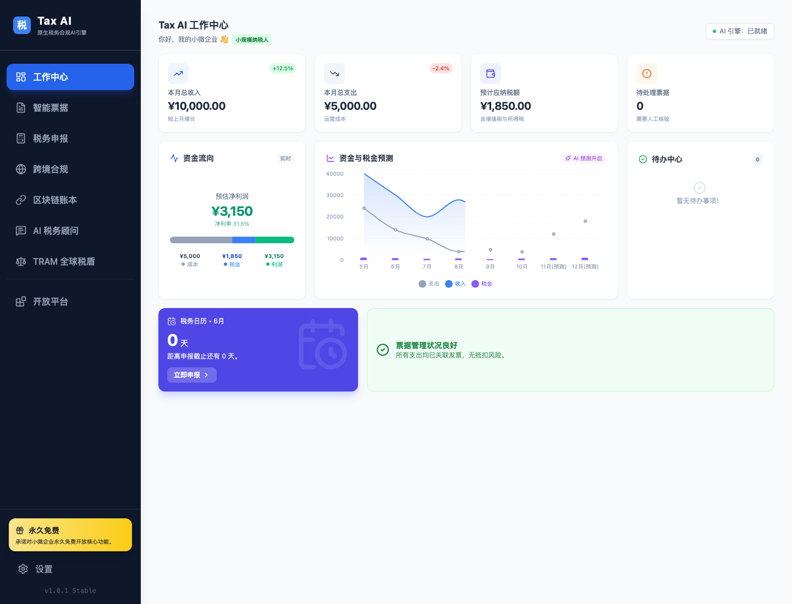
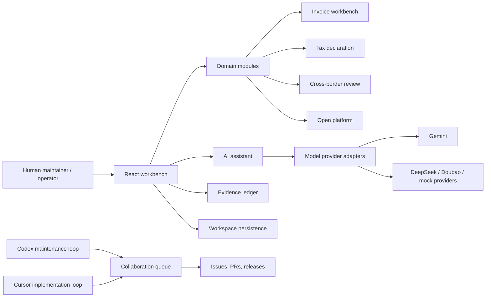

# Tax AI

An open source framework for tax-focused human-AI collaboration.

[](https://github.com/panghim/Tax-Ai/actions/workflows/ci.yml)
[](https://github.com/panghim/Tax-Ai/actions/workflows/pages.yml)
[](https://github.com/panghim/Tax-Ai/releases)
[](LICENSE)

Tax AI is an open source framework prototype for tax-focused human-AI collaboration. It currently ships as a Vite + React + TypeScript application that demonstrates invoice collection, tax declaration flows, AI tax advice, cross-border tax review, blockchain-style evidence tracking, and an open platform integration surface.

The goal is to let future finance and tax agents, operator dashboards, workflow queues, and third-party connectors share the same domain contracts instead of becoming separate one-off tools.

## Demo

The public demo is deployed with GitHub Pages:

[https://panghim.github.io/Tax-Ai/](https://panghim.github.io/Tax-Ai/)

The demo is a browser-only framework preview. AI calls that require external credentials may fall back to mock behavior or show service errors unless `GEMINI_API_KEY` is configured in a local environment.



## Architecture



The architecture direction is documented in [docs/framework-architecture.md](docs/framework-architecture.md). The queue that keeps human and AI maintainers aligned is tracked in [docs/collaboration-queue.md](docs/collaboration-queue.md).

## Current Scope

- Invoice and evidence intake: invoices, contracts, receipts, bank and platform sync simulations.
- Tax workbench: VAT, corporate income tax, payroll tax, zero declaration and R&D deduction workflows.
- AI assistant: Gemini-backed tax advice with local simulated DeepSeek/Doubao adapters.
- Cross-border tax: product classification, landed cost estimation, compliance diagnostics and TRAM review.
- Audit evidence: local blockchain-style evidence ledger for invoices, declarations, TRAM reports and amendments.
- Open platform: integration marketplace model for finance, HR, payment, ecommerce and logistics systems.

## Framework Direction

The framework is organized around four horizontal layers:

1. Domain contracts: shared tax, invoice, declaration, evidence and collaboration types.
2. Capability modules: UI or service modules with explicit input/output ownership.
3. Collaboration queue: Cursor and Codex handoff records for open source development.
4. Quality gates: type checking, build checks, and CI workflows before merging.

See [Framework Architecture](docs/framework-architecture.md), [Collaboration Queue](docs/collaboration-queue.md), and [Codex Usage Plan](docs/codex-usage.md).

## Run Locally

Prerequisites: Node.js 20 or later.

```bash
npm install
cp .env.example .env.local
npm run dev
```

Set `GEMINI_API_KEY` in `.env.local` if you want Gemini-powered document parsing and tax advice. Without a key, some AI calls will fail or fall back to local mock responses.

## Validation

```bash
npm run typecheck
npm run build
npm run test
npm run check
```

## Repository Map

```text
App.tsx                  Application shell and shared in-browser state
components/              Product modules and workbench screens
services/                AI and evidence ledger service adapters
framework/               Cross-module framework contracts and registry
docs/                    Architecture, roadmap and collaboration queue
db/                      SQL schema draft for a future backend
prisma/                  Prisma schema draft for a future backend
.github/workflows/       CI for open source contribution checks
```

## Contribution Model

This repository uses a lightweight Cursor + Codex queue:

- Cursor: local implementation, component cleanup, focused feature branches.
- Codex: repo-wide structure, verification, queue grooming, PR readiness.

Start with [CONTRIBUTING.md](CONTRIBUTING.md), then pick a task from [docs/collaboration-queue.md](docs/collaboration-queue.md).

## Open Source Readiness

Tax AI is being prepared for public open source collaboration. The current support-program application notes are in [docs/oss-application.md](docs/oss-application.md), and release preparation is tracked in [docs/release-checklist.md](docs/release-checklist.md).

## Releases

- `v0.1.0`: open source framework baseline.
- `v0.2.0`: framework extraction release covering AI provider adapters, deterministic tax calculation tests, workspace persistence, integration registry extraction, schema alignment, and invoice workbench component split.

## Maintainer Activity

- Public demo deployed with GitHub Pages.
- `v0.2.0` release published after a maintainer PR batch.
- `loyputh` added as a maintainer with write access.
- Community traction has reached 65 GitHub stars and 2 forks.
- Weekly maintenance records are kept in [docs/maintenance-log.md](docs/maintenance-log.md).

## Status

This is not production tax software. Treat all tax calculations, declarations, blockchain records and policy advice as framework prototypes until connected to verified policy sources, audited calculation engines, and real authority integrations.
